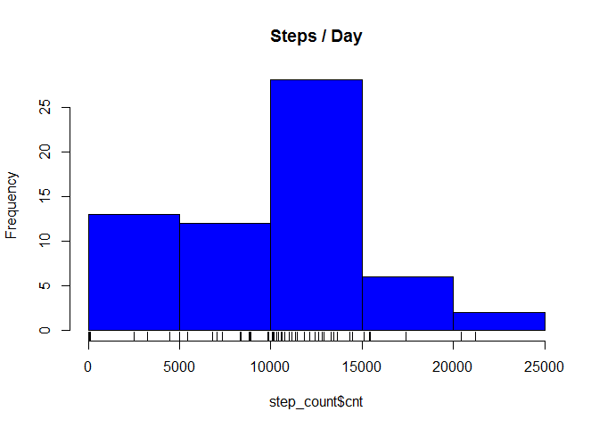
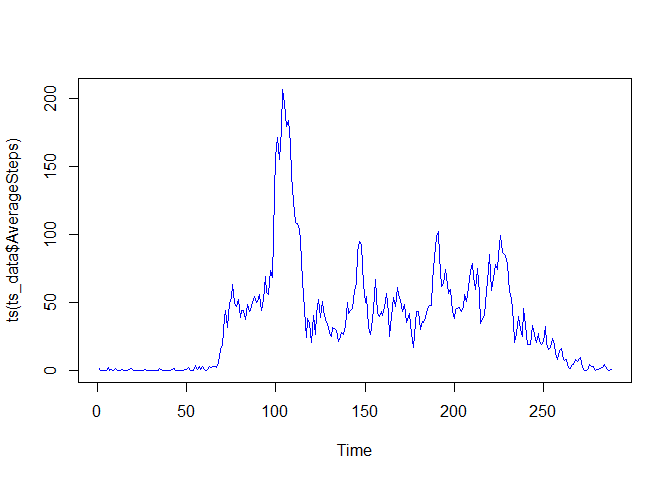
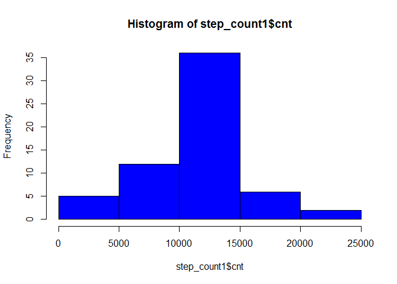
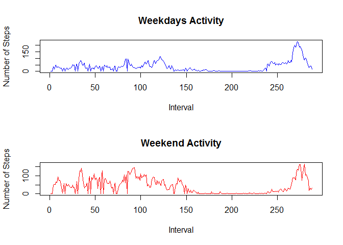
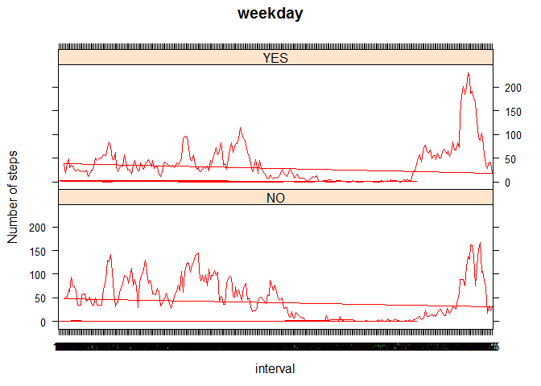

# Reproducible_Research_Assignment1
Mahesh Yerra  
14 June 2015  
###Loading and preprocessing the data
#####Show any code that is needed to

1.Load the data (i.e. read.csv())

```r
activity <- read.csv("D:/hLearn/Coursera_DataScience Specialization_JhonHopkins University/My DSS/activity.csv",header=TRUE,sep=",")
head(activity)
```

```
##   steps       date interval
## 1    NA 2012-10-01        0
## 2    NA 2012-10-01        5
## 3    NA 2012-10-01       10
## 4    NA 2012-10-01       15
## 5    NA 2012-10-01       20
## 6    NA 2012-10-01       25
```

```r
summary(activity)
```

```
##      steps                date          interval     
##  Min.   :  0.00   2012-10-01:  288   Min.   :   0.0  
##  1st Qu.:  0.00   2012-10-02:  288   1st Qu.: 588.8  
##  Median :  0.00   2012-10-03:  288   Median :1177.5  
##  Mean   : 37.38   2012-10-04:  288   Mean   :1177.5  
##  3rd Qu.: 12.00   2012-10-05:  288   3rd Qu.:1766.2  
##  Max.   :806.00   2012-10-06:  288   Max.   :2355.0  
##  NA's   :2304     (Other)   :15840
```
2.Process/transform the data (if necessary) into a format suitable for your analysis


```r
class(activity$date)
```

```
## [1] "factor"
```

```r
class(activity$steps)
```

```
## [1] "integer"
```

```r
class(activity$interval)
```

```
## [1] "integer"
```
###What is mean total number of steps taken per day?

#####For this part of the assignment, you can ignore the missing values in the dataset.

1.Calculate the total number of steps taken per day


```r
library(psych)
step_count<-as.data.frame(matrix(data=NA,nrow=length(levels(activity$date)),ncol=2))
names(step_count) <- c("date","cnt")
for ( i in 1:length(levels(activity$date))){
  step_count$date[i] <- levels(activity$date)[i]
  step_count$cnt[i] <- sum(activity[which(activity$date == levels(activity$date)[i]),]$steps,na.rm = TRUE)
}

head(step_count)
```

```
##         date   cnt
## 1 2012-10-01     0
## 2 2012-10-02   126
## 3 2012-10-03 11352
## 4 2012-10-04 12116
## 5 2012-10-05 13294
## 6 2012-10-06 15420
```
2.If you do not understand the difference between a histogram and a barplot, research the difference between them. Make a histogram of the total number of steps taken each day


```r
hist(step_count$cnt,col='blue', main="Steps / Day")
rug(step_count$cnt)
```

 

3.Calculate and report the mean and median of the total number of steps taken per day

```r
summary(step_count)
```

```
##      date                cnt       
##  Length:61          Min.   :    0  
##  Class :character   1st Qu.: 6778  
##  Mode  :character   Median :10395  
##                     Mean   : 9354  
##                     3rd Qu.:12811  
##                     Max.   :21194
```
###### Median :10395
###### Mean   : 9354

### What is the average daily activity pattern?

1.Make a time series plot (i.e. type = "l") of the 5-minute interval (x-axis) and the average number of steps taken, averaged across all days (y-axis)


```r
interval_summary <- as.data.frame((describeBy(activity$steps,activity$interval,mat=TRUE)))

head(interval_summary)
```

```
##    item group1 vars  n      mean        sd median trimmed mad min max
## 11    1      0    1 53 1.7169811 7.9768351      0       0   0   0  47
## 12    2      5    1 53 0.3396226 2.4724902      0       0   0   0  18
## 13    3     10    1 53 0.1320755 0.9615239      0       0   0   0   7
## 14    4     15    1 53 0.1509434 1.0988845      0       0   0   0   8
## 15    5     20    1 53 0.0754717 0.5494423      0       0   0   0   4
## 16    6     25    1 53 2.0943396 8.7557984      0       0   0   0  52
##    range     skew kurtosis        se
## 11    47 4.714164 21.68059 1.0957026
## 12    18 6.873212 46.11214 0.3396226
## 13     7 6.873212 46.11214 0.1320755
## 14     8 6.873212 46.11214 0.1509434
## 15     4 6.873212 46.11214 0.0754717
## 16    52 4.538859 20.74557 1.2027014
```

```r
ts_data <- interval_summary[,c(2,5)]
names(ts_data) <- c("interval","AverageSteps")

plot(ts(ts_data$AverageSteps),col="blue",col.axis="Red")
```

 

2.Which 5-minute interval, on average across all the days in the dataset, contains the maximum number of steps?

```r
print("Interval with Max Average Steps:")
```

```
## [1] "Interval with Max Average Steps:"
```

```r
ts_data[which(ts_data$AverageSteps == max(ts_data$AverageSteps)),]
```

```
##      interval AverageSteps
## 1104      835     206.1698
```
###### Row         interval         AverageSteps
###### 1104          835            206.1698

###Imputing missing values

######Note that there are a number of days/intervals where there are missing values (coded as NA). The presence of missing days may introduce bias into some calculations or summaries of the data.

1.Calculate and report the total number of missing values in the dataset (i.e. the total number of rows with NAs)

```r
na_rows <- summary(is.na(activity$steps))[3]
na_rows
```

```
##   TRUE 
## "2304"
```
2.Devise a strategy for filling in all of the missing values in the dataset. The strategy does not need to be sophisticated. For example, you could use the mean/median for that day, or the mean for that 5-minute interval, etc.

####Response: 
######Calculate the mean steps for each interval across all days(ts_data).Identify the all the rows withs NA values, Then fill the "NA" s with Average steps for corresponding intervals.

3.Create a new dataset that is equal to the original dataset but with the missing data filled in.

```r
activity1 <- activity
for ( i in 1:nrow(activity1)){
  if (!is.na(activity1$steps[i])) activity1$steps[i] <- activity1$steps[i] else activity1$steps[i] <- ts_data[which(ts_data$interval == activity1$interval[i]),2]
}

summary(is.na(activity1$steps))
```

```
##    Mode   FALSE    NA's 
## logical   17568       0
```
4.Make a histogram of the total number of steps taken each day and Calculate and report the mean and median total number of steps taken per day. Do these values differ from the estimates from the first part of the assignment? What is the impact of imputing missing data on the estimates of the total daily number of steps?


```r
step_count1<-as.data.frame(matrix(data=NA,nrow=length(levels(activity1$date)),ncol=2))
names(step_count1) <- c("date","cnt")
for ( i in 1:length(levels(activity1$date))){
  step_count1$date[i] <- levels(activity1$date)[i]
  step_count1$cnt[i] <- sum(activity1[which(activity1$date == levels(activity1$date)[i]),]$steps,na.rm = TRUE)
}

head(step_count1)
```

```
##         date      cnt
## 1 2012-10-01 10766.19
## 2 2012-10-02   126.00
## 3 2012-10-03 11352.00
## 4 2012-10-04 12116.00
## 5 2012-10-05 13294.00
## 6 2012-10-06 15420.00
```

```r
hist(step_count1$cnt,col="blue")
```

 

```r
summary(step_count1)
```

```
##      date                cnt       
##  Length:61          Min.   :   41  
##  Class :character   1st Qu.: 9819  
##  Mode  :character   Median :10766  
##                     Mean   :10766  
##                     3rd Qu.:12811  
##                     Max.   :21194
```
###### Median  :10766
###### Mean    :10766

#### Explanation: 
######After filling missing values with Average steps for respective intervals, Total steps/day Distribution became a very near Normal Distribution with both Mean and Median = 10766, in earlier case Mean and Median are different.

###Are there differences in activity patterns between weekdays and weekends?

#####For this part the weekdays() function may be of some help here. Use the dataset with the filled-in missing values for this part.

1.Create a new factor variable in the dataset with two levels – “weekday” and “weekend” indicating whether a given date is a weekday or weekend day.

```r
for (i in 1:nrow(activity1)){
if (weekdays(as.Date(activity1$date[i])) == "Saturday" | weekdays(as.Date(activity1$date[i])) =="Sunday") activity1$weekday[i] <- "NO" else activity1$weekday[i] <- "YES"
}

head(activity1)
```

```
##       steps       date interval weekday
## 1 1.7169811 2012-10-01        0     YES
## 2 0.3396226 2012-10-01        5     YES
## 3 0.1320755 2012-10-01       10     YES
## 4 0.1509434 2012-10-01       15     YES
## 5 0.0754717 2012-10-01       20     YES
## 6 2.0943396 2012-10-01       25     YES
```

2.Make a panel plot containing a time series plot (i.e. type = "l") of the 5-minute interval (x-axis) and the average number of steps taken, averaged across all weekday days or weekend days (y-axis). See the README file in the GitHub repository to see an example of what this plot should look like using simulated data.


```r
interval_summary1_wkday <- as.data.frame((describeBy(activity1[which(activity1$weekday == "YES"),]$steps,activity1[which(activity1$weekday == "YES"),]$interval,mat=TRUE)))

head(interval_summary1_wkday)
```

```
##    item group1 vars  n       mean        sd median     trimmed mad min max
## 11    1      0    1 45 2.25115304 8.6005313      0 0.232024477   0   0  47
## 12    2      5    1 45 0.44528302 2.6789143      0 0.027536971   0   0  18
## 13    3     10    1 45 0.17316562 1.0418000      0 0.010708822   0   0   7
## 14    4     15    1 45 0.19790356 1.1906286      0 0.012238654   0   0   8
## 15    5     20    1 45 0.09895178 0.5953143      0 0.006119327   0   0   4
## 16    6     25    1 45 1.59035639 5.6958957      0 0.283018868   0   0  35
##    range     skew kurtosis         se
## 11    47 4.249848 17.43103 1.28209151
## 12    18 6.249173 37.97645 0.39934896
## 13     7 6.249173 37.97645 0.15530237
## 14     8 6.249173 37.97645 0.17748843
## 15     4 6.249173 37.97645 0.08874421
## 16    35 4.746013 23.83247 0.84909400
```

```r
interval_summary1_wknd <- as.data.frame((describeBy(activity1[which(activity1$weekday == "NO"),]$steps,activity1[which(activity1$weekday == "NO"),]$interval,mat=TRUE)))

head(interval_summary1_wknd)
```

```
##    item group1 vars  n        mean          sd median     trimmed mad min
## 11    1      0    1 16 0.214622642  0.58646070      0 0.122641509   0   0
## 12    2      5    1 16 0.042452830  0.11600322      0 0.024258760   0   0
## 13    3     10    1 16 0.016509434  0.04511236      0 0.009433962   0   0
## 14    4     15    1 16 0.018867925  0.05155698      0 0.010781671   0   0
## 15    5     20    1 16 0.009433962  0.02577849      0 0.005390836   0   0
## 16    6     25    1 16 3.511792453 12.94977358      0 0.299191375   0   0
##           max      range     skew kurtosis          se
## 11  1.7169811  1.7169811 2.058539 2.398996 0.146615176
## 12  0.3396226  0.3396226 2.058539 2.398996 0.029000804
## 13  0.1320755  0.1320755 2.058539 2.398996 0.011278090
## 14  0.1509434  0.1509434 2.058539 2.398996 0.012889246
## 15  0.0754717  0.0754717 2.058539 2.398996 0.006444623
## 16 52.0000000 52.0000000 3.264599 9.289431 3.237443395
```

```r
ts_wkday <- interval_summary1_wkday[,c(2,5)]
names(ts_wkday) <- c("interval","weekday")
ts_wknd <- interval_summary1_wknd[,c(2,5)]
names(ts_wknd) <- c("interval","weekend")

ts_new <- merge(ts_wkday,ts_wknd,by="interval")
head(ts_new)
```

```
##   interval    weekday     weekend
## 1        0  2.2511530  0.21462264
## 2       10  0.1731656  0.01650943
## 3      100  0.4205451  0.04009434
## 4     1000 37.8754717 48.13325472
## 5     1005 18.2197065 51.62264151
## 6     1010 39.0775681 51.80188679
```

```r
opar<-par()
par(mfrow=c(2,1))


plot(ts(ts_new$weekday),col="blue",main="Weekdays Activity",ylab="Number of Steps",xlab="Interval")
plot(ts(ts_new$weekend),col="Red",main="Weekend Activity",ylab="Number of Steps",xlab="Interval")
```

 

### Alternative Lattice Code


```r
library(lattice)
ts1<-ts_wkday
names(ts1)<-c("interval","steps")
ts1$weekday <- "YES"
temp<-ts_wknd
names(temp)<-c("interval","steps")
temp$weekday <- "NO"
head(temp)
```

```
##    interval       steps weekday
## 11        0 0.214622642      NO
## 12        5 0.042452830      NO
## 13       10 0.016509434      NO
## 14       15 0.018867925      NO
## 15       20 0.009433962      NO
## 16       25 3.511792453      NO
```

```r
ts1<-rbind(ts1,temp)

xyplot(steps ~ interval |weekday,data=ts1,type="l",ylab="Number of steps",main="weekday",col="red",layout=c(1,2),panel=lattice.getOption("panel.xyplot"))
```

 
